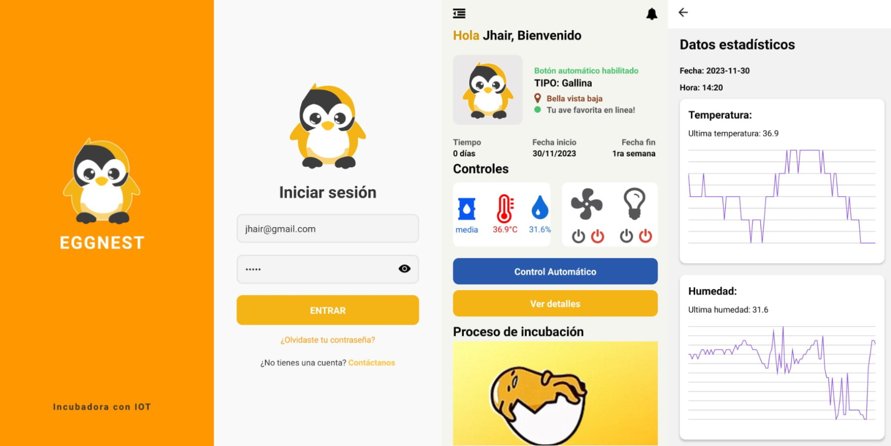

<div align="center">
    <a href="https://github.com/JheysonJhair/app_react-native_client_eggnest">
      
    </a>
    <h1>EggNest - Monitoreo de Incubadora en Tiempo Real</h1>
    <p align="center">
        Desarrollador Jhair
    </p>
</div>



# EggNest

Bienvenido a **EggNest**, una aplicación móvil desarrollada con React Native y Expo, diseñada para el monitoreo en tiempo real de incubadoras. Esta aplicación permite a los usuarios controlar y visualizar las condiciones dentro de la incubadora, asegurando un ambiente óptimo para el desarrollo de los huevos.

## Tecnologías Utilizadas

- **React Native**: Biblioteca utilizada para el desarrollo de la interfaz de usuario.
- **Expo**: Plataforma para desarrollar y compilar aplicaciones de React Native de forma rápida y sencilla.
- **CSS**: Estilización de componentes para una interfaz amigable y atractiva.

---

## Características de la Aplicación

- **Monitoreo en Tiempo Real**: Visualiza la temperatura, humedad y otros parámetros críticos de la incubadora.
- **Notificaciones**: Recibe alertas en caso de que los parámetros excedan los límites establecidos.
- **Interfaz Intuitiva**: Diseño fácil de usar que permite una navegación fluida.

---

## Instalación

1. **Requisitos previos**:
   - Tener instalado **Node.js** y **npm** en tu sistema.
   - Instalar **Expo CLI** globalmente:
     ```bash
     npm install -g expo-cli
     ```

2. **Clonar el repositorio**:
   ```bash
   git clone https://github.com/JheysonJhair/app_react-native_client_eggnest.git
   cd app_react-native_client_eggnest

2. **Instalar las dependencias**:
   ```bash
    npm install

2. **Ejecutar la aplicación**:
   ```bash
    expo start
